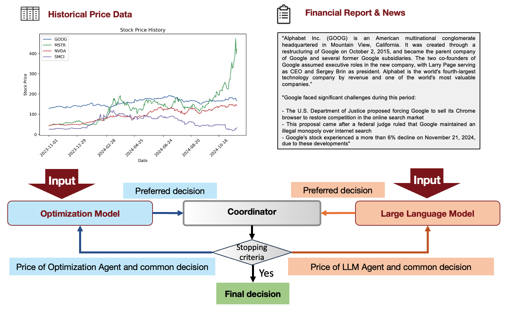
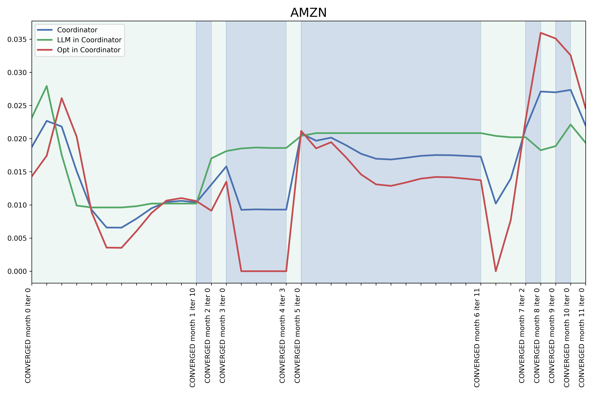
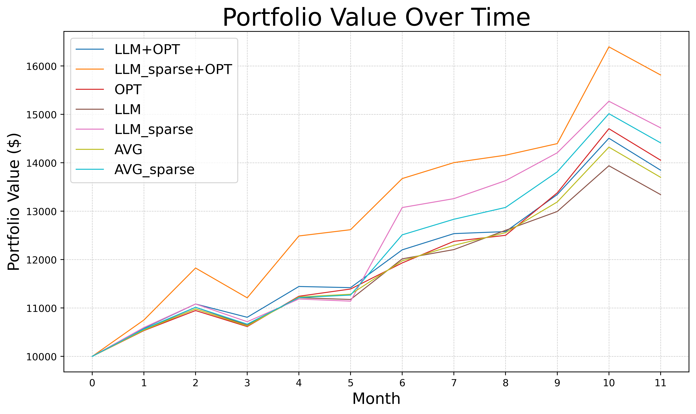

# SOLID: a Framework of Synergizing Optimization and Large Language Models for Intelligent Decision-Making

Authors: Yinsheng Wang [1], Tario You [2], Léonard Boussioux [3][4][5], Shan Liu [1]

1 University of Washington, Department of Industrial & Systems Engineering

2 University of Washington, College of Engineering

3 University of Washington, Michael G. Foster School of Business 

4 University of Washington, Paul G. Allen School of Computer Science and Engineering 

5 Laboratory for Innovation Science at Harvard 

{yinshw,tarioy,leobix,liushan}@uw.edu

> Paper under review. We've already been accepted to <a href="https://aaai.org/conference/aaai/aaai-25/bridge-ai-orms/">AAAI's Bridge Program</a>!

## Abstract

This paper introduces SOLID (Synergizing Optimization and Large Language Models for Intelligent Decision-Making), a novel framework that integrates mathematical optimization with the contextual capabilities of large language models (LLMs). Drawing inspiration from the alternating direction method of multipliers (ADMM), SOLID facilitates iterative collaboration between optimization and LLMs agents through dual prices and deviation penalties. This interaction improves the quality of the decisions while maintaining modularity and data privacy. The framework retains theoretical convergence guarantees under convexity assumptions, providing insight into the design of LLMs prompt. To evaluate SOLID, we applied it to a stock portfolio investment case with historical prices and financial news as inputs. Empirical results demonstrate convergence under various scenarios and indicate improved annualized returns compared to a baseline optimizer-only method, validating the synergy of the two agents. SOLID offers a promising framework for advancing automated and intelligent decision-making across diverse domains.

## Demo 

### Framework

  

### Coordination between investment strategies of the LLM and the optimizer, e.g. AMZN:

  

### Back testing:

  

### Stock Weights:

  

### Profit and Loss per Stock:
