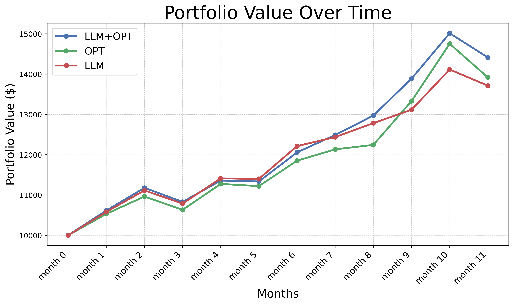
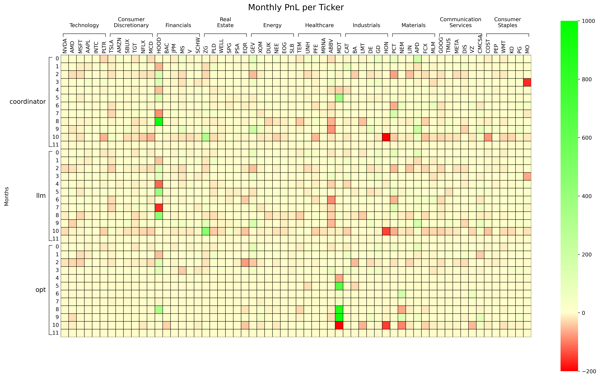

# SOLID: a Framework of Synergizing Optimization and Large Language Models for Intelligent Decision-Making

Authors: Yinsheng Wang [1], Tario You [2], Léonard Boussioux [3][4][5]

1 University of Washington, Department of Industrial & Systems Engineering

2 University of Washington, College of Engineering

3 University of Washington, Michael G. Foster School of Business 

4 University of Washington, Paul G. Allen School of Computer Science and Engineering 

5 Laboratory for Innovation Science at Harvard 

{yinshw,tarioy,leobix}@uw.edu

> Note this is still a work in progress. We are working to get it published. We've already been accepted to <a href="https://aaai.org/conference/aaai/aaai-25/bridge-ai-orms/">AAAI's Bridge Program</a>!

## Abstract

This paper introduces SOLID (Synergizing Optimization and Large Language Models for Intelligent Decision-Making), a new framework that combines the quan- titative precision of mathematical optimization with the contextual intelligence of large language models (LLMs). Inspired by the alternating direction method of multipliers (ADMM), establishes a coordinated interaction mechanism where optimization and LLM agents iteratively align decisions through dual pricing and deviation penalties. This approach enhances decision quality, ensures modularity, and safeguards data privacy. Applications in portfolio optimization with alternative data and personalized nutrition recommendations highlight the framework’s ver- satility, with initial results demonstrating convergence and validating its ability to synergize structured and unstructured data. By uniting prescriptive modeling with generative AI capabilities, SOLID sets a new benchmark for advancing intelligent decision-making across diverse domains.

## Demo 

Coordination between investment strategies of the LLM and the optimizer:

  
Back testing:

  
Stock Weights:

  
Profit and Loss per Stock:
